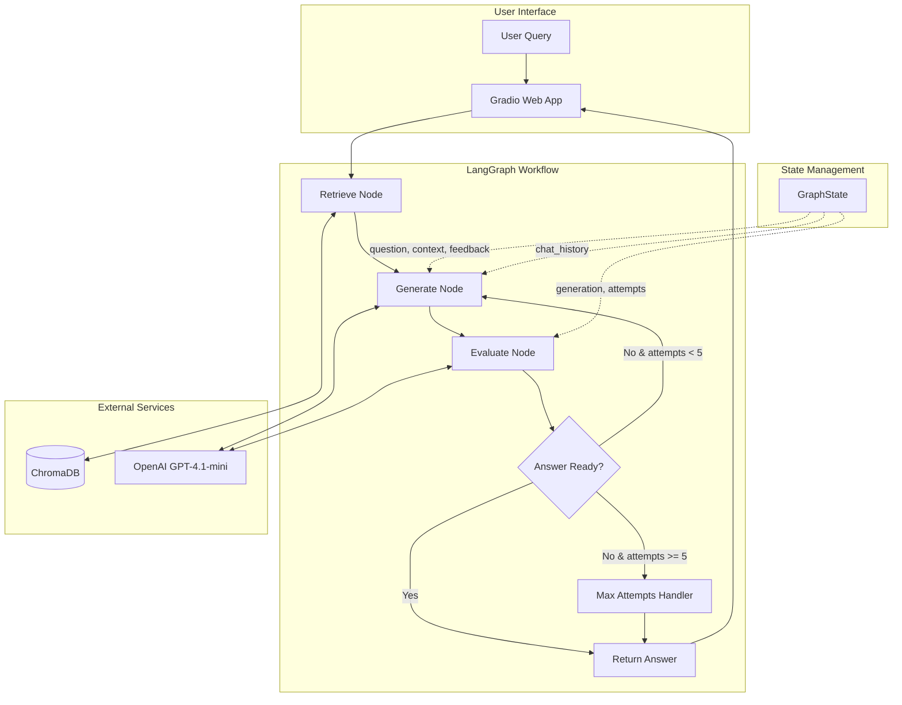
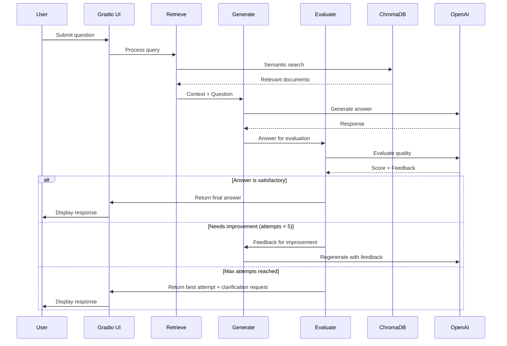

# RAG Chatbot

An agentic Retrieval-Augmented Generation (RAG) chatbot built with LangChain and LangGraph, featuring an evaluator-optimizer loop for improved answer quality.

## Table of Contents

- [Overview](#overview)
- [Architecture](#architecture)
- [Setup Instructions](#setup-instructions)
- [LangGraph Components](#langgraph-components)
- [Limitations](#limitations)
- [License](#license)

## Overview

This project implements an intelligent RAG chatbot that goes beyond simple retrieval and generation. It features an **agentic workflow** where:

1. **User submits a query** through a Gradio web interface
2. **Retriever** fetches relevant documents from a ChromaDB vector store
3. **Generator** creates an answer based on the retrieved context
4. **Evaluator** reviews the answer quality and provides feedback
5. **Optimization loop** regenerates improved answers based on feedback (up to 5 attempts)

Key features:
- **Self-improving responses**: The evaluator-generator feedback loop ensures higher quality answers
- **Conversation memory**: Maintains chat history for contextual follow-up questions
- **Multi-language support**: Responds in the same language as the user's question
- **Containerized deployment**: Docker support for easy deployment
- Optional:
   - **LangSmith**: Tracking and logging

## Architecture



### Data Flow



## Setup Instructions

### Prerequisites

- Python 3.12+
- [uv](https://github.com/astral-sh/uv) (recommended) or pip
- OpenAI API key
- Docker (optional, for containerized deployment)

### Example of Enironmental Variables
```ini
# OpenAI API Key (required)
OPENAI_API_KEY=your_openai_api_key_here

# Optional: LangSmith tracing
# LANGCHAIN_TRACING_V2=true
# LANGCHAIN_API_KEY=your_langsmith_api_key
# LANGCHAIN_PROJECT=rag-chatbot
```

### Local Development

1. **Clone the repository**

   ```bash
   git clone https://github.com/nerkyzas157/RAG-chatbot.git
   cd RAG-chatbot
   ```

2. **Create environment file**

   ```bash
   cp .env.example .env
   # Edit .env and add your OpenAI API key
   ```

   Required environment variables:
   ```
   OPENAI_API_KEY=your_openai_api_key_here
   ```

3. **Install dependencies**

   ```bash
   uv sync
   ```

4. **Ingest documents** (first time only)

   ```bash
   uv run python ingestion.py
   ```

5. **Run the application**

   ```bash
   uv run python main.py
   ```

6. **Access the web interface**

   Open http://localhost:7860 in your browser.

### Docker Deployment

1. **Build the image**

   ```bash
   docker build -t rag-chatbot .
   ```

2. **Run with environment file**

   ```bash
   docker run -p 7860:7860 \
     --env-file .env \
     -v $(pwd)/.chroma:/app/.chroma \
     rag-chatbot
   ```

3. **Or run with inline environment variable**

   ```bash
   docker run -p 7860:7860 \
     -e OPENAI_API_KEY=your_api_key \
     -v $(pwd)/.chroma:/app/.chroma \
     rag-chatbot
   ```

4. **Ingest documents in Docker** (if `.chroma` is empty)

   ```bash
   docker run --env-file .env \
     -v $(pwd)/.chroma:/app/.chroma \
     rag-chatbot python ingestion.py
   ```

## LangGraph Components

### GraphState

The central state object that flows through the entire workflow:

| Field | Type | Description |
|-------|------|-------------|
| `question` | `str` | User's input question |
| `documents` | `List[Document]` | Retrieved documents from vector store |
| `context` | `str` | Combined document contents |
| `generation` | `str` | Generated answer |
| `feedback` | `Optional[str]` | Evaluator feedback for improvement |
| `attempts` | `int` | Current attempt count |
| `max_attempts` | `int` | Maximum allowed attempts (default: 5) |
| `answer_ready` | `bool` | Whether the answer passed evaluation |
| `chat_history` | `List[tuple]` | Previous (user, assistant) message pairs |

### Nodes

#### 1. Retrieve Node (`graph/nodes/retrieve.py`)

- **Purpose**: Fetches relevant documents from ChromaDB based on semantic similarity
- **Input**: User question from state
- **Output**: Updates `documents` and `context` in state
- **Error handling**: Returns empty context if retrieval fails

#### 2. Generate Node (`graph/nodes/generate.py`)

- **Purpose**: Creates an answer using the LLM with context and optional feedback
- **Input**: Question, context, feedback, chat history
- **Output**: Updates `generation` in state
- **Features**: Incorporates evaluator feedback for iterative improvement

#### 3. Evaluate Node (`graph/nodes/evaluate.py`)

- **Purpose**: Assesses answer quality against the original question
- **Input**: Question and generated answer
- **Output**: Updates `answer_ready`, `feedback`, and `attempts` in state
- **Model**: Uses structured output (Pydantic) for consistent evaluation

#### 4. Max Attempts Handler (`graph/graph.py`)

- **Purpose**: Handles cases where the evaluator loop reaches maximum iterations
- **Input**: Current generation
- **Output**: Appends clarification request to the response

### Conditional Routing

The `should_continue` function determines the next step after evaluation:

```
evaluate → answer_ready=True → END (return answer)
evaluate → answer_ready=False & attempts<5 → generate (retry)
evaluate → answer_ready=False & attempts>=5 → max_attempts → END
```

### Chains

#### Generation Chain (`graph/chains/generator.py`)

- Uses `gpt-4.1-mini` model
- Prompt includes: question, context, feedback, chat history
- Outputs string response via `StrOutputParser`

#### Evaluation Chain (`graph/chains/evaluator.py`)

- Uses `gpt-4.1-mini` with structured output
- Returns `GradeAnswer` object with:
  - `binary_score`: Whether answer is satisfactory
  - `feedback`: Improvement suggestions (if score is negative)

## Limitations

### Technical Limitations

1. **Single PDF Source**: Currently configured for a single PDF document. Multiple document sources would require ingestion modifications.

2. **Context Window**: Large documents may exceed LLM context limits. The retriever returns top-k chunks which may miss relevant information.

3. **Embedding Model Dependency**: Uses OpenAI embeddings (`text-embedding-3-large`). Switching providers requires re-ingestion of all documents.


### Functional Limitations

1. **Memory Scope**: Chat history is session-based and not persisted. Restarting the application clears conversation history.

2. **Language Detection**: Multi-language support relies on LLM interpretation. May occasionally respond in wrong language for ambiguous queries.

### Performance Limitations

1. **Latency**: Multiple LLM calls (generation + evaluation + potential retries) increase response time.

2. **Cost**: Each query may invoke the LLM up to 10 times (5 generate + 5 evaluate calls) in worst case.

3. **Vector Store**: ChromaDB is suitable for development but may need replacement (Pinecone, Weaviate) for production scale.

## License

This project is licensed under the MIT License - see the [LICENSE](LICENSE) file for details.
